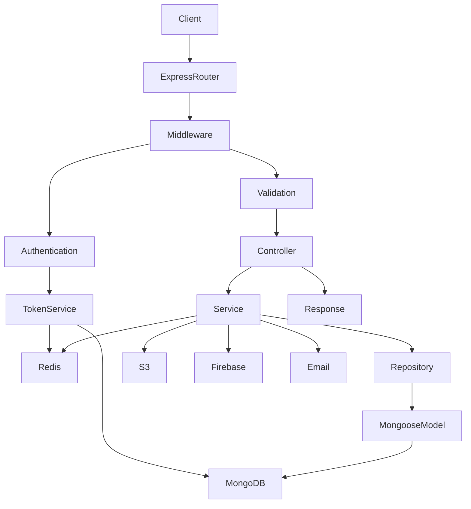
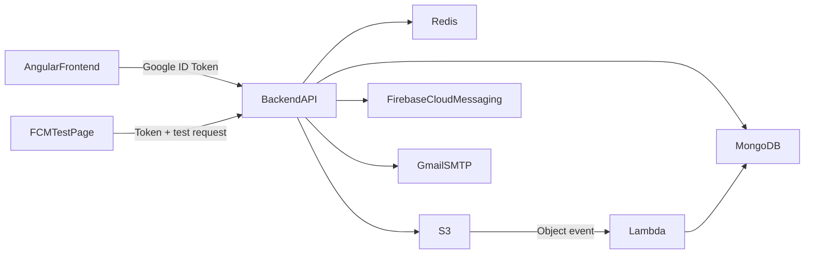
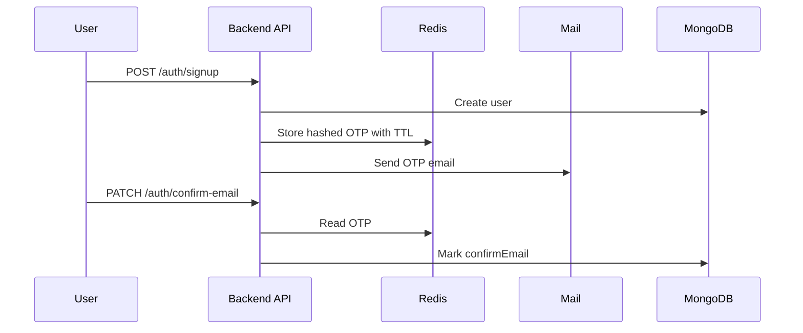
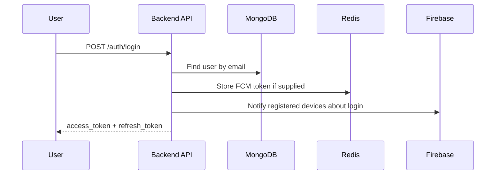
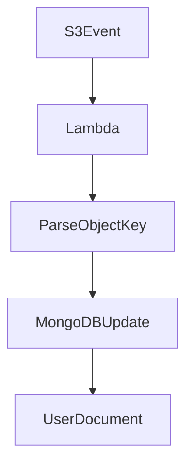

# Full Project Documentation

## 1. Project Overview

This repository contains a multi-part social media application workspace centered on a TypeScript/Node.js backend API, a small Angular frontend prototype for Google sign-in, a standalone Firebase Cloud Messaging demo client, and an AWS Lambda helper for updating user profile images after S3 uploads.

### What the project does

The main backend provides:

- User authentication with email/password and Google sign-in
- Email confirmation using OTP codes stored in Redis
- JWT-based session management with access and refresh tokens
- User profile operations
- Post creation, listing, reacting, and updating
- Comment creation and nested replies on posts
- Media handling through AWS S3 uploads and pre-signed URLs
- Push notifications through Firebase Cloud Messaging

### Main purpose

The project is building a social-media-style platform where users can:

- Register and log in
- Maintain profile media
- Publish posts with media attachments
- Mention other users
- Comment and reply to comments
- Receive push notifications for logins and mentions

### Target users

- End users of a social networking application
- Developers experimenting with social login, media uploads, and notifications
- Team members building a full-stack social app incrementally

### Business domain

- Social networking
- User-generated content
- Media asset management
- Notification-driven engagement

### Current maturity snapshot

The backend is the most developed part of the repository. The Angular frontend is still a thin prototype, the Firebase demo is a separate test utility, and the Lambda function is a focused helper rather than a complete serverless subsystem.

---

## 2. Repository Structure

### Top-level layout

```text
Social media/
|-- backend/                  # Main Express + TypeScript API
|-- frontend/                 # Angular prototype for Google login
|-- Application_FCM_FE/       # Standalone browser demo for Firebase push testing
|-- lambda function/          # AWS Lambda for S3-driven MongoDB updates
|-- src/                      # Small root TypeScript scaffold, likely unused
|-- package.json              # Minimal root dev script
|-- tsconfig.json             # Minimal root TypeScript config
|-- Fire_base.txt             # Firebase notes and exposed config values
|-- Social_Media_APP_accessKeys.csv  # AWS access keys file committed to repo
```

### Hidden and support files reviewed

- `backend/.gitignore`
- `frontend/.gitignore`
- `frontend/.editorconfig`
- `frontend/.vscode/extensions.json`
- `frontend/.vscode/launch.json`
- `frontend/.vscode/tasks.json`
- `frontend/.angular/cache/...` present as generated build cache
- `lambda function/.env`

### Important absence checks

The following project-owned files were not found:

- `.env.example`
- `Dockerfile`
- `docker-compose.yml` or `docker-compose.yaml`
- `.github/workflows/*`
- `nginx.conf`
- `schema.prisma`
- Prisma migrations
- Kubernetes manifests

---

## 3. Tech Stack

### Frontend Technologies

| Technology | Where Used | Why It Is Used |
| --- | --- | --- |
| Angular 20 | `frontend/` | Provides a structured SPA framework for the client-side app. |
| TypeScript | `frontend/src` | Gives type safety and Angular-native development ergonomics. |
| `@abacritt/angularx-social-login` | `frontend/package.json` | Intended to simplify Google social authentication integration. |
| Angular HttpClient | `frontend/src/app/services/auth.ts` | Sends login requests from the Angular app to the backend. |
| SCSS | Angular app styles | Default Angular styling choice; currently minimally used. |
| Google Identity Services script | `frontend/src/index.html` | Renders the Google sign-in button and returns ID tokens. |

### Backend Technologies

| Technology | Where Used | Why It Is Used |
| --- | --- | --- |
| Node.js | `backend/` | Runtime for the API and supporting services. |
| Express 5 | `backend/src/app.bootstrap.ts` | Handles routing, middleware, JSON APIs, and HTTP responses. |
| TypeScript | `backend/src` | Adds type safety across controllers, services, DTOs, and models. |
| Mongoose | `backend/src/DB` | Defines MongoDB schemas, models, and repository access patterns. |
| Zod | `backend/src/modules/*/*.validation.ts` | Validates request bodies, params, and queries. |
| JSON Web Tokens | `backend/src/common/services/token.service.ts` | Implements access and refresh token-based authentication. |
| Bcrypt | `backend/src/common/utils/security/hash.security.ts` | Hashes passwords and compares login credentials. |
| Node Crypto | `backend/src/common/utils/security/encryption.security.ts` | Encrypts sensitive fields such as phone numbers. |
| Nodemailer | `backend/src/common/utils/email/send.email.ts` | Sends OTP and account emails through Gmail SMTP. |
| Redis | `backend/src/common/services/redis.service.ts` | Stores OTPs, revocation data, and FCM token sets. |
| Firebase Admin SDK | `backend/src/common/services/notificatio.service.ts` | Sends push notifications to devices. |
| AWS SDK for S3 | `backend/src/common/services/s3.service.ts` | Uploads assets, fetches objects, and creates pre-signed URLs. |
| Multer | `backend/src/common/utils/multer` | Handles multipart file uploads. |
| `google-auth-library` | `backend/src/modules/auth/auth.service.ts` | Verifies Google ID tokens during Google sign-up/login. |

### Databases and Storage

| Technology | Where Used | Why It Is Used |
| --- | --- | --- |
| MongoDB | Main persistence layer | Stores users, posts, and comments. |
| Redis | Session and OTP support | Supports fast TTL-based workflows and token invalidation. |
| AWS S3 | Media storage | Stores profile images, cover images, and post/comment attachments. |

### DevOps and Operations

| Technology | Where Used | Why It Is Used |
| --- | --- | --- |
| `dotenv` | Backend and Lambda | Loads environment variables from files. |
| `concurrently` | Root and backend scripts | Runs TypeScript compiler and watched Node process together. |
| Angular CLI | `frontend/` | Builds, serves, and tests the Angular app. |
| VS Code workspace files | `frontend/.vscode` | Supports developer launch and task automation. |

### Authentication and Identity

| Technology | Where Used | Why It Is Used |
| --- | --- | --- |
| Email/password auth | Backend auth module | Primary native authentication path. |
| Google sign-in | Angular + backend auth module | Supports external identity provider login. |
| JWT access token | Backend auth/token services | Authenticates normal API requests. |
| JWT refresh token | User token rotation flow | Renews sessions. |
| Redis-backed token revocation | Token and user services | Invalidates stolen or logged-out sessions. |
| OTP email confirmation | Auth service + Redis + Nodemailer | Verifies user email ownership. |

### External APIs and Platforms

| Service | Where Used | Why It Is Used |
| --- | --- | --- |
| Google Identity Services | Angular app | Browser-side Google sign-in button and ID token generation. |
| Google OAuth verification | Backend auth service | Validates Google ID tokens server-side. |
| Firebase Cloud Messaging | Backend + FCM demo | Sends push notifications for logins and mentions. |
| Gmail SMTP | Email utility | Delivers confirmation emails and OTPs. |
| AWS S3 | Backend + Lambda | Media storage and object event integration. |

### Testing Tools

| Tool | Where Used | Why It Is Used |
| --- | --- | --- |
| Jasmine | Angular unit tests | Default Angular unit testing framework. |
| Karma | Angular test runner | Runs browser-based Angular tests. |

### Not present

- No backend test framework is configured
- No end-to-end test suite is configured
- No lint scripts are defined
- No CI/CD tooling is committed
- No containerization setup is committed

---

## 4. Project Architecture

### High-level architecture

This repository is best described as a monorepo-style workspace with one primary backend service and several supporting or experimental clients/utilities.

- `backend/` is the main application
- `frontend/` is a prototype client for Google login
- `Application_FCM_FE/` is a manual test page for FCM
- `lambda function/` is a serverless helper that reacts to S3 events
- root `src/` appears to be leftover scaffold code and is not integrated with the backend

### Architectural style

The backend follows a layered modular monolith pattern:

- Controllers define HTTP endpoints
- Services hold business logic
- Repositories wrap persistence operations
- Mongoose models define schema behavior
- Shared utilities provide security, email, storage, and validation helpers

It is not strict Clean Architecture or DDD, but it does separate transport, business, and persistence concerns reasonably well.

### Backend request lifecycle



### Cross-system interaction



### Folder structure explanation

#### `backend/src`

- `main.ts`: starts the backend bootstrap
- `app.bootstrap.ts`: creates the Express app and registers routes
- `config/`: loads environment configuration
- `DB/model/`: Mongoose schemas and model behavior
- `DB/repository/`: generic and entity-specific data access classes
- `modules/`: domain modules such as auth, user, post, comment
- `middleware/`: authentication, authorization, validation, error handling
- `common/services/`: Redis, token, S3, security, notification services
- `common/utils/`: hashing, encryption, email helpers, multer helpers, OTP, post visibility helpers
- `common/interfaces/`: shared TypeScript interfaces
- `common/enums/`: domain enums such as roles, providers, token types

#### `frontend/src`

- `main.ts`: bootstraps Angular application and social login config
- `app/app.ts`: renders a Google sign-in button
- `app/services/auth.ts`: posts the Google token to the backend
- `app.routes.ts`: currently empty routing setup
- tests exist, but appear stale versus actual component names and template behavior

#### `Application_FCM_FE`

- `firebase.js`: initializes Firebase web messaging
- `app.js`: registers service worker, requests permission, generates FCM token, sends test request
- `firebase-messaging-sw.js`: handles background notifications

#### `lambda function`

- `index.mjs`: listens to S3 event records and updates the `SOCIAL_APP_USERS` collection
- `.env`: local MongoDB configuration for the function

### Design patterns used

- Layered architecture
- Repository pattern
- Service pattern
- DTO and schema validation pattern
- Event-driven email dispatch using `EventEmitter`
- Soft-delete style query filtering on Mongoose models
- Token revocation through cache-based blacklist keys

### Monolith vs microservices

The core backend is a monolith. The Lambda function is a separate supporting component, but the overall system is not a microservice architecture.

---

## 5. Backend Deep Dive

### Application bootstrap

The backend starts in `backend/src/main.ts`, which calls `bootstrap()` from `backend/src/app.bootstrap.ts`.

The bootstrap function:

- Creates an Express application
- Enables JSON parsing and CORS
- Exposes a root health-like route at `/`
- Exposes `/send-notification` for manual push testing
- Registers feature routers under `/auth`, `/user`, and `/post`
- Exposes nested comment routes under post routes
- Streams S3 assets back through `/uploads/*path`
- Generates pre-signed fetch URLs through `/pre-signed/*path`
- Adds a catch-all 404 route
- Registers the global error handler
- Connects to MongoDB and Redis
- Starts the server on `PORT`

### Middleware pipeline

#### Authentication

The `authentication()` middleware:

- Reads the `Authorization` header
- Expects a bearer-like credential format
- Uses `TokenService.decodeToken()` to parse and verify JWTs
- Loads the current user from MongoDB
- Attaches `req.user` and `req.decoded`

#### Authorization

The `authorization()` middleware:

- Checks whether `req.user.role` is included in allowed roles
- Is currently used only on the profile endpoint

#### Validation

The `validation()` middleware:

- Accepts a partial request schema keyed by `body`, `params`, or `query`
- Validates input using Zod
- Injects uploaded `file` or `files` into `req.body` before validation
- Throws a `BadRequestException` with structured validation details

#### Error handling

The global error handler:

- Maps `MulterError` to `400`
- Returns message, cause, stack, and raw error object

This is useful in development but unsafe in production because stack traces and internal error objects are exposed to clients.

---

## 6. API Modules and Endpoints

### Auth module

Base route: `/auth`

| Method | Route | Purpose | Notes |
| --- | --- | --- | --- |
| `POST` | `/auth/login` | Email/password login | Optional `FCM` token can be stored in Redis. |
| `POST` | `/auth/signup` | Native account registration | Sends email OTP after account creation. |
| `PATCH` | `/auth/confirm-email` | Confirm email via OTP | Requires `email` and `otp`. |
| `PATCH` | `/auth/resend-confirm-email` | Resend OTP | Uses Redis throttling and blocking logic. |
| `POST` | `/auth/signup/gmail` | Google sign-up or login | Verifies Google ID token. |

#### Auth business logic

- Native signup checks email uniqueness, creates user, and sends OTP
- Login verifies system-provider user and password hash
- Google signup creates a `ProviderEnum.GOOGLE` account if absent
- Existing Google accounts are logged in directly
- OTPs are hashed before being stored in Redis
- Email confirmation sets `confirmEmail` on the user document

### User module

Base route: `/user`

| Method | Route | Purpose | Notes |
| --- | --- | --- | --- |
| `PATCH` | `/user/profile-cover-images` | Upload cover images | Uses multipart upload and stores up to 2 images. |
| `PATCH` | `/user/profile-image` | Request pre-signed upload URL | Returns upload URL and key metadata path intent. |
| `GET` | `/user/` | Return current profile | Requires authentication and role check. |
| `POST` | `/user/logout` | Revoke current or all sessions | Depends on `flag`. |
| `POST` | `/user/rotate-token` | Refresh login credentials | Requires refresh token auth. |
| `DELETE` | `/user/` | Delete account | Attempts S3 folder cleanup and database deletion. |

#### User business logic

- Cover images are uploaded to S3 and old cover images are deleted
- Profile image endpoint currently returns a pre-signed upload URL rather than uploading directly
- Logout supports current-session revocation or all-session invalidation
- Token rotation blocks refresh if the access token is still considered valid
- Account deletion removes the user record and tries to delete S3 content

### Post module

Base route: `/post`

| Method | Route | Purpose | Notes |
| --- | --- | --- | --- |
| `POST` | `/post/` | Create post | Supports text, image attachments, mentions, visibility. |
| `GET` | `/post/` | List posts | Supports pagination and search. |
| `PATCH` | `/post/:postId/react` | Like or unlike post | Query param `react` controls add/remove behavior. |
| `PATCH` | `/post/:postId` | Update post | Supports attachment and mention changes. |

#### Post business logic

- Post visibility is controlled through `AvailabilityEnum`
- Mentioned users trigger FCM notifications
- Attachments are stored in S3 under a generated folder ID
- Listing populates nested comments and replies
- Search is regex-based on `content`

### Comment module

Nested base route: `/post/:postId/comment`

| Method | Route | Purpose | Notes |
| --- | --- | --- | --- |
| `POST` | `/post/:postId/comment/` | Create comment | Supports text, image attachments, and mentions. |
| `POST` | `/post/:postId/comment/:commentId/reply` | Reply to a comment | Stores parent comment reference. |

#### Comment business logic

- Validates access against post visibility
- Reuses the post folder for attachment storage
- Notifies mentioned users through FCM
- Supports reply nesting through `commentId`

### Utility routes

| Method | Route | Purpose |
| --- | --- | --- |
| `GET` | `/` | Landing response |
| `POST` | `/send-notification` | Manual FCM notification testing |
| `GET` | `/uploads/*path` | Streams S3 objects back to client |
| `GET` | `/pre-signed/*path` | Returns pre-signed S3 download URL |

---

## 7. Data Model and Database Design

### Database choice

The main application uses MongoDB through Mongoose. Redis is used as an operational support store rather than a primary data store.

### Collections

#### `SOCIAL_APP_USERS`

Defined by `user.model.ts`.

Key fields:

- `firstName`
- `lastName`
- virtual `username`
- `email` with `unique: true`
- `password` only required for system-provider users
- `phone` encrypted before save
- `profilePicture`
- `ProfileCoverPictures`
- `gender`
- `role`
- `provider`
- `friends`
- `confirmEmail`
- `changeCredentialsTime`
- soft-delete metadata
- timestamps

Model behavior:

- Password is hashed in a pre-save hook
- Phone is encrypted in a pre-save hook
- Most queries exclude soft-deleted records by default
- Update hooks manage `deletedAt` and `restoredAt`

#### `SOCIAL_APP_POSTS`

Defined by `post.model.ts`.

Key fields:

- `folderId`
- `content`
- `attachments`
- `availability`
- `likes`
- `tags`
- `createdBy`
- `updatedBy`
- soft-delete metadata
- timestamps

Model behavior:

- Virtual `comments` links post to comments by `postId`
- Default queries exclude soft-deleted records

#### Comments collection

Defined by `comment.model.ts`, but there is a serious inconsistency:

- The schema is for comments
- The `collection` is also set to `SOCIAL_APP_POSTS`

This means comments are configured to share the same collection name as posts, which is almost certainly unintended and can corrupt the data model or break query assumptions.

Comment fields:

- `content`
- `attachments`
- `likes`
- `tags`
- `postId`
- `commentId`
- `createdBy`
- `updatedBy`
- soft-delete metadata
- timestamps

Comment behavior:

- Virtual `reply` links comments to child comments
- Uses the same soft-delete style hooks as posts/users

### Repository layer

The generic `DatabaseRepository<T>` provides:

- `create`, `createOne`
- `findOne`, `find`, `paginate`, `findById`
- `findOneAndUpdate`, `findByIdAndUpdate`, `updateOne`, `updateMany`
- delete methods

Entity-specific repositories simply extend the generic class.

### Pagination design

The repository returns:

- `docs`
- optional `currentPage`
- optional `size`
- optional `pages`

If `page` is omitted or `0`, it returns without paging metadata.

---

## 8. Authentication and Authorization

### Native authentication flow



### Login flow



### JWT strategy

The JWT design includes:

- Access and refresh token types
- Different secrets for user and system/admin roles
- Audience array used to carry token type and role
- Redis-backed token revocation via `jti`
- `changeCredentialsTime` invalidation for all-session logout

### Google sign-in

The frontend gets a Google ID token and sends it to `/auth/signup/gmail`. The backend verifies the ID token using `google-auth-library` and either:

- Creates a Google-provider user
- Or logs in an existing Google-provider user

### Authorization

Role-based authorization exists, but is only lightly applied. The current explicit endpoint policy is:

- `endpoint.profile = [RoleEnum.USER]`

There is no broad role matrix across admin/user behaviors yet.

---

## 9. Media and File Handling

### Upload handling

Multer is used for multipart upload parsing with:

- Memory storage for smaller assets
- Temporary disk storage for larger uploads
- MIME-type validation for images and MP4 videos

### S3 usage

The S3 service supports:

- Single upload
- Multipart large upload
- Multi-file upload
- Pre-signed upload URL creation
- Pre-signed fetch URL creation
- Direct object fetch
- Object deletion
- Batch deletion
- Prefix listing

### Storage paths

Observed path conventions:

- User profile image: `APPLICATION_NAME/Users/{userId}/Profile/...`
- User cover images: `APPLICATION_NAME/Users/{userId}/Profile/Cover/...`
- Post attachments: `APPLICATION_NAME/Post/{folderId}/...`

### Download and proxy behavior

The backend offers two retrieval patterns:

- Direct streaming through `/uploads/*path`
- Client redirect/download flows through `/pre-signed/*path`

---

## 10. Notifications

### Firebase Admin notifications

The backend can send:

- Single-device notifications
- Multi-device notifications using `Promise.allSettled`

Notification use cases currently implemented:

- New login notification
- Mention in a post
- Mention in a comment
- Mention in a reply
- Manual test notification through `/send-notification`

### FCM token storage

Redis stores FCM tokens as sets keyed by user ID:

- `user:FCM:{userId}`

### Browser FCM test app

`Application_FCM_FE/` is not integrated into the Angular app. It is a separate test page that:

- Registers a service worker
- Requests notification permission
- Generates an FCM token using a VAPID key
- Sends the token to `/send-notification`
- Displays foreground and background notifications

---

## 11. Frontend Analysis

### Angular app status

The Angular app is very small and currently serves mainly as a Google login proof of concept.

Implemented behavior:

- Bootstraps a standalone Angular app
- Loads Google Identity Services
- Renders a Google sign-in button
- Sends the returned ID token to `http://localhost:3000/auth/signup/gmail`

### Frontend/backend communication

Current direct communication points:

- Angular app -> `POST /auth/signup/gmail`
- FCM demo -> `POST /send-notification`

Missing or not yet implemented:

- No shared API service layer
- No token storage strategy
- No route guards
- No authenticated screens
- No feed, profile, post creation, or comment UI
- No handling of backend-issued JWTs beyond logging response

### Frontend architecture maturity

This is currently a prototype rather than a production-ready frontend.

### Frontend testing quality

The Angular tests appear stale:

- `app.spec.ts` imports `App` from `./app`
- the actual exported class is `AppComponent`
- the tested rendered title does not match the simplified component template

This suggests the tests are default scaffold leftovers and are likely failing or obsolete.

---

## 12. Lambda Function Analysis

### Purpose

The Lambda function reacts to S3 object events and updates a user document in MongoDB with a new `profilePicture` path.

### Flow



### Expected S3 key structure

The function expects keys where:

- `parts[2]` = custom ID
- `parts[3]` = attachment type
- `parts[4]` = file name

It then writes the full key into `profilePicture`.

### Observations

- Connects lazily to MongoDB and reuses the client
- Uses native MongoDB driver, not Mongoose
- Ignores malformed S3 keys
- Logs update results for each record

### Limitations

- The imported `profile` symbol from `node:console` is unused
- `arrayFilters` is passed to `updateOne()` without any array update, so it appears unnecessary
- The key parsing depends on a strict path convention

---

## 13. Environment and Configuration

### Backend environment variables

The backend expects `.env.{NODE_ENV}` files and reads values such as:

- `PORT`
- `DB_URI`
- `RESIS_DB_URI`
- `APPLICATION_NAME`
- `EMAIL_APP`
- `EMAIL_APP_PASSWORD`
- `USER_ACCESS_TOKEN_SECRET_KEY`
- `SYSTEM_ACCESS_TOKEN_SECRET_KEY`
- `USER_REFRESH_TOKEN_SECRET_KEY`
- `SYSTEM_REFRESH_TOKEN_SECRET_KEY`
- `ENC_KEY`
- `FACEBOOK`
- `INSTAGRAM`
- `TWITTER`
- `ENC_IV_LENGTH`
- `ACCESS_EXPIRES_IN`
- `REFRESH_EXPIRES_IN`
- `CLIENT_IDS`
- `SALT_ROUND`
- `AWS_REGION`
- `AWS_BUCKET_NAME`
- `AWS_ACCESS_KEY_ID`
- `AWS_SECRET_ACCESS_KEY`
- `AWS_EXPIRES_IN`

### Lambda environment variables

The Lambda function `.env` contains:

- `DB_URI`
- `DB_NAME`

### Configuration behavior

- Backend config is centralized in `backend/src/config/config.ts`
- Missing values are mostly not validated at startup
- Some values have defaults, such as token TTL and salt rounds

### Missing configuration support

- No `.env.example`
- No schema validation for environment variables
- No separation of secrets from repository content

---

## 14. Security Analysis

### Critical security issues

#### 1. Real secrets are committed to the repository

Sensitive materials are stored directly in version-controlled files:

- Firebase service account JSON in `backend/src/config/`
- AWS access keys in `Social_Media_APP_accessKeys.csv`
- Firebase web keys and VAPID key in browser-facing files
- Lambda `.env` committed with database connection details
- `Fire_base.txt` contains raw Firebase configuration notes

This is the most serious issue in the repository and should be remediated immediately by rotating all exposed credentials.

#### 2. Error responses leak stack traces

The global error handler returns:

- `stack`
- raw `error`
- internal `cause`

This leaks implementation detail and can expose secrets, object structure, and attack surface to clients.

#### 3. No startup validation for required secrets

The backend casts many environment variables with `as string` and proceeds without fail-fast validation. This creates:

- unpredictable runtime failures
- weak deployment safety
- hard-to-debug production issues

#### 4. Email OTP throttling exists but is basic

The OTP design is better than none, but could still be improved with:

- stronger audit logging
- IP/device rate limiting
- explicit resend counters per time window

### Moderate security concerns

- CORS is enabled with default permissive behavior
- Tokens are returned but no secure cookie strategy is used
- Google sign-in issuer value is constructed incorrectly in one route as ``${req.protocol}:??${req.host}``
- Firebase service account is read from disk instead of secure secret injection
- Authorization coverage is minimal
- Production logging contains decoded token data and secrets in console output

### Positive security practices

- Passwords are hashed with bcrypt
- Phone values are encrypted before persistence
- OTPs are hashed before being stored in Redis
- Token revocation is implemented
- Session invalidation on credential change is implemented
- Zod input validation is used in many routes

---

## 15. Performance and Scalability Analysis

### Strengths

- Redis is used for hot operational data
- S3 is used for binary/media storage instead of MongoDB blobs
- Multi-part upload support exists for large files
- FCM token sets are stored in Redis

### Current bottlenecks and risks

#### API-level

- No request rate limiting
- No response compression
- No caching headers beyond basic stream delivery
- Regex search on posts is simple and may not scale well without indexes

#### Database-level

- No visible query index strategy beyond model defaults and `syncIndexes()`
- Comment collection misconfiguration can cause severe data problems
- Deep nested `populate` for comments/replies may become expensive as data grows

#### Storage-level

- Attachment cleanup is manual and partial
- Some upload/delete paths rely on convention and may drift

#### Application-level

- Push notifications are fanned out inline during request handling
- Email sending is evented but still in-process, not queue-backed
- No job queue or worker system exists for heavy background work

### Scalability recommendations

- Introduce message queues for notifications and emails
- Add MongoDB indexes for frequent filters and search fields
- Move comment tree reads to paged endpoints
- Add environment validation and observability before horizontal scaling
- Store auth sessions or refresh-token metadata with stronger lifecycle controls

---

## 16. Logging and Error Handling

### Logging

Current logging is ad hoc `console.log()` usage across:

- bootstrap
- token verification
- file handling
- auth flows
- Lambda execution
- Redis events

### Error handling strategy

- Domain/application exceptions carry status codes
- Middleware converts thrown exceptions into JSON responses
- Some routes still wrap logic with manual `try/catch`

### Gaps

- No structured logger
- No log levels
- No correlation IDs
- No request tracing
- No centralized observability tooling

---

## 17. Testing and Code Quality

### Backend testing

- No backend tests are present
- No backend test script is defined
- No integration tests for routes, auth, Redis, MongoDB, or S3 flows

### Frontend testing

- Angular default spec files are present
- Tests appear outdated relative to current component implementation

### Type safety and code quality observations

Positive points:

- TypeScript is used throughout backend and frontend
- DTO types are inferred from Zod in several modules

Issues:

- Some types are too loose or cast aggressively
- Some dead code and unused imports remain
- Some file names and symbols have spelling inconsistencies
- Root workspace contains duplicate scaffold files unrelated to the backend

---

## 18. Build, Scripts, and Developer Workflow

### Root scripts

`package.json` at the repository root only provides:

- `start:dev`: runs `tsc --watch` and `node --watch dist/index.js`

This appears tied to the root `src/` scaffold, not the real backend.

### Backend scripts

- `start:dev`: compiles TypeScript and runs `dist/main.js` in development mode
- `start:prod`: same watch-based pattern with `NODE_ENV=production`

This is not a true production start command because it still depends on watch mode and concurrent compilation.

### Frontend scripts

- `start`
- `build`
- `watch`
- `test`

### Developer support files

The frontend includes VS Code tasks and Chrome launch configurations for:

- `ng serve`
- `ng test`

---

## 19. Deployment and Infrastructure Status

### Present

- Environment variable loading
- AWS S3 integration
- Firebase integration
- AWS Lambda helper

### Not present

- No Dockerfile
- No Compose stack
- No Kubernetes manifests
- No Nginx reverse proxy config
- No GitHub Actions workflows
- No Terraform or infrastructure-as-code
- No deployment scripts

### Operational implication

This repository is currently developer-oriented and prototype-oriented rather than deployment-ready.

---

## 20. Coding Patterns and Notable Inconsistencies

### Good patterns

- Clear module separation
- Centralized config file
- Shared service classes
- Shared validation helpers
- Repository abstraction

### Inconsistencies and likely bugs

- `comment.model.ts` uses collection name `SOCIAL_APP_POSTS`
- `modules/index.ts` comments out direct comment export, but post router still imports comment router
- `auth.controller.ts` builds issuer string incorrectly in `/login`
- `user.service.ts` deletes S3 path with `User/...` while uploads use `Users/...`
- `s3.service.ts` has hard-coded `YOUR_BUCKET_NAME` in `deleteFolderByPrefix()`
- `post.model.ts` sets `comments` virtual with `justOne: true`, even though a post should have many comments
- `comment.model.ts` defines `postId` and `commentId` as arrays of ObjectIds instead of single ObjectIds
- `DatabaseRepository.paginate()` calls `countDocuments({ filter })` instead of `countDocuments(filter)`
- `frontend/app.spec.ts` references an outdated component shape
- Root `src/` and root `package.json` likely represent unused leftover scaffold

---

## 21. Beginner-Friendly Request Lifecycle Examples

### Example: Native signup

1. Client sends `email`, `password`, `confirmPassword`, `username`, and optional `phone` to `/auth/signup`.
2. Zod validates the request.
3. Auth service checks whether the email already exists.
4. User is created in MongoDB.
5. Password is hashed before save.
6. Phone is encrypted before save if provided.
7. OTP is generated and hashed into Redis with TTL.
8. Email is sent through Gmail SMTP.

### Example: Create post with images

1. Client sends text, attachments, mentions, and visibility to `/post/`.
2. Multer parses uploaded files.
3. Zod validates text, files, and mention IDs.
4. Mentioned users are loaded from MongoDB.
5. Media files are uploaded to S3.
6. Post record is created in MongoDB.
7. Mentioned users receive push notifications through Firebase.

### Example: Profile image update via pre-signed URL

1. Client calls `/user/profile-image`.
2. Backend creates a pre-signed upload URL for S3.
3. Client uploads directly to S3.
4. Separate Lambda may update the MongoDB record after S3 event delivery.

---

## 22. Recommendations

### Immediate priorities

1. Rotate all exposed secrets and remove them from the repository.
2. Fix the comment collection/schema issues before further development.
3. Stop returning stack traces and raw errors to clients.
4. Add `.env.example` and startup config validation.
5. Replace hard-coded bucket placeholders and path mismatches.

### Short-term engineering priorities

1. Add backend integration tests for auth, posts, comments, and token rotation.
2. Build a real frontend API layer and authenticated user flows.
3. Add structured logging and environment-aware error handling.
4. Normalize naming, remove dead code, and clean leftover scaffolding.
5. Introduce CI for type-checking and tests.

### Medium-term architecture priorities

1. Introduce queue-backed background jobs for emails and notifications.
2. Add indexing, pagination strategy, and efficient comment retrieval.
3. Decide whether Lambda-driven profile updates remain part of the design.
4. Add containerization and deployment automation.

---

## 23. Final Assessment

This codebase is a promising social-media backend with meaningful work already implemented around auth, posts, comments, file storage, and notifications. The backend architecture is understandable and modular enough to extend. However, the repository is still at an early-to-mid implementation stage and has several major production blockers:

- exposed secrets
- schema/data model inconsistencies
- prototype frontend maturity
- missing deployment and CI tooling
- limited tests
- several correctness issues in route and storage behavior

The backend is the true core of the project. The Angular app, FCM demo page, root scaffold, and Lambda helper should be documented and maintained as supporting components until the product architecture is clarified further.
